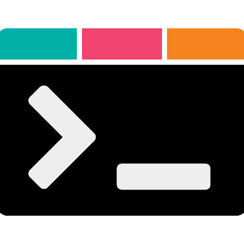

# devSA

<strong>Because believe that `Tech in San Antonio` is more than just gov contracts</strong>

Beyond the billion-dollar industry that powers Military City, USA is a community of designers, marketing agencies and web developers in San Antonio creating online experiences on platforms that reach millions of people every day

Our goal is simple, `connect the worlds of design, marketing, web, mobile and cloud development` by providing a platform for creatives and technologists to share their work, ask for help, find inspiration, and contribute to the growth of this community

## About

devSA is a community of creatives and technologists who share a common goal, `leverage the power of the web to deliver exceptional user experiences.`

The user doesn't care about the tools you use, and neither do we. This platform is here for you to share your work, ask for help, find inspiration, and contribute to the growth of this community.

Our goal is to provide support by connecting the worlds of design, marketing, web, mobile and cloud development.

## Community

As our platform grows, our goal is to expand the events space and fully utilize the power of the web. We want to facilitate discussions on the tools, techniques, and technologies that are shaping the future of design and development for users in San Antonio and beyond

## The devSA SHOP

[The devSA SHOP](https://www.devsanantonio.shop)

It's a mix of this:

-   Elevate your wardrobe and show the world that you're a force in the digital realm. Wear the latest design and web development trends before they become deprecated and forgotten forever

And this:

-   Celebrates the rich, Mexican-inspired culture and storied history of San Antonio by incorporating vibrant colors, captivating motifs, and authentic elements into every theme and design we create.

But mostly this:

-   A way to support the community and help us grow. All proceeds go towards the development of this platform and the events we host.

## Thank you for your support

We're excited to see what the future holds for this community and we hope you'll join us on this journey.

Come say hello and join us on [Discord](https://discord.gg/f3gnmjScW3) to stay up to date with the latest news and events
